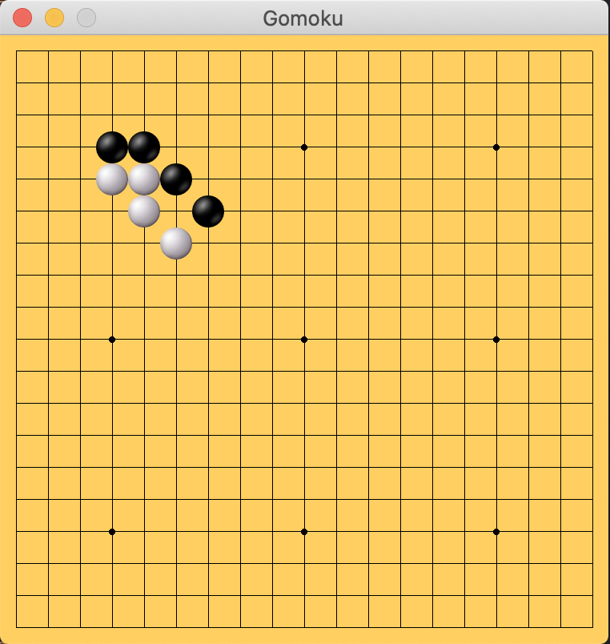
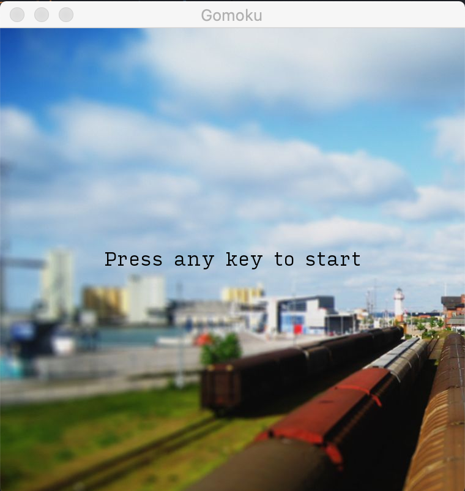
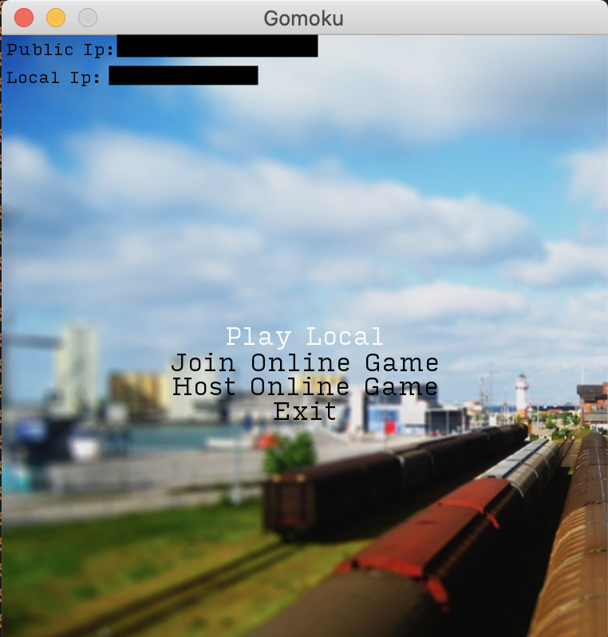
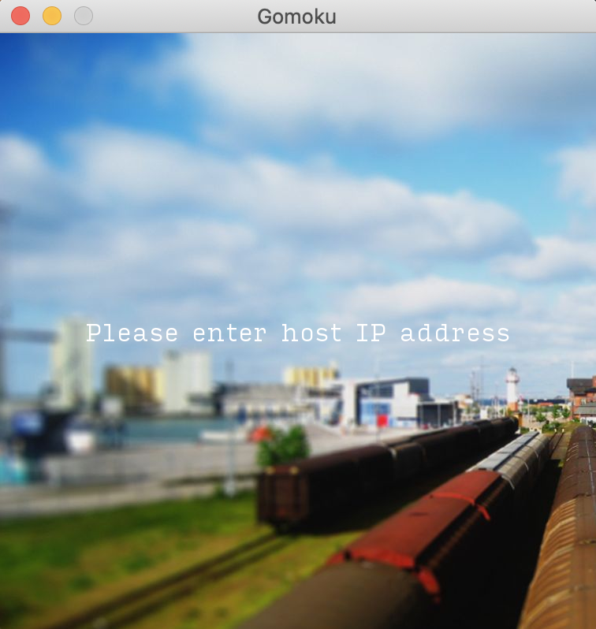
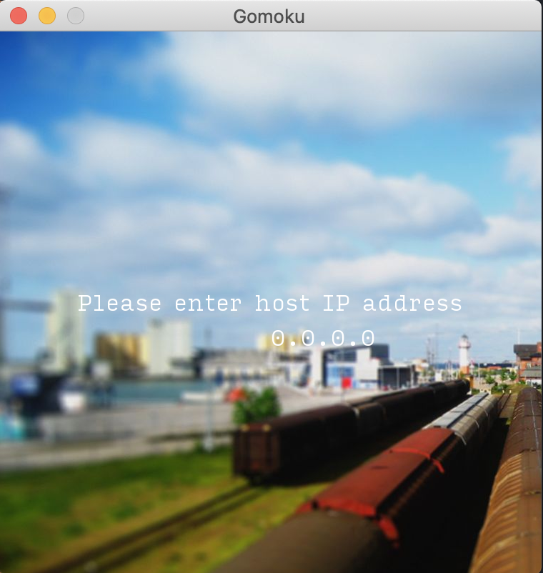

# About

A simple [gomoku](https://en.wikipedia.org/wiki/Gomoku) game that allows both local (on one machine) and over the network play.

The game looks basically like the game of Go. It's played using the same board and stones but it's got a simpler rules.

# How to play

Please note that currently only Mac and Linux is supported.
If you are on mac, you can use this [installer](https://github.com/louixs/gomoku/raw/master/mac_installer/gomoku-mac-package.pkg). Running it will automatically install all the dependencies (mainly SFML).

Once you start the game, you'll be presented with a title screen.
You can press any key to proceed to the next menu screen.

## Menu

You can navigate between the menu items by using arrow up/down keys on your keyboard.
Hit enter key to start the game mode that you have selected. The menu screen also shows your public IP and local IP. If you are in the same network as your host, and are joining you can ask your host for their local IP. You'll be prompted to enter it in the next screen. If your host is on a different network you can ask for your hosts's public IP. 

### Local game

This is the mode in which two players play one after another on the same machine. 

### Join Online Game

This mode is for joining a game by connecting a host.
If not done yet, ask your counter part to select the "Host Online Game" option first.
Then ask your host for their IP address - local or public depending on where you are.
Once you hit enter, you'll see a prompt to enter host's ip address.
Enter your host's IP address and hit enter again to connect and start the game.
Once the connection has successfully established with the game server, the game will show the text that it has started. 

You can type in numbers and period once you see this screen. Delete button should also work if you need to correct.

Once you have finished typing in the IP address, hit enter to proceed. (Please note the address shown on the screenshot is an example).

### Host Online Game

This mode spawns up a game instance and a server instance. The server will need to accept incoming connections to allow another player to join the game over the network. Make sure to note your IP addresses displayed on the menu screen so that your counter part joining the game can connect. 

If you are both in the same local network, the joiner needs to put the local IP address. This mode should be easier to make it work. You or your counter part's firewall or security software may block incoming/outbound traffic. Check the configuration of firewall or security software if connection fails.

If you are not in the same local network and if you are both behind NAT (typically by being connected to the internet via a router), it might be a little tricky to get connected. If your ISP has provided you with a public IP address, you can configure your router to forward port 51781 to your machine. Note that some ISP put you behind their NAT as well. In that case, and if you really want to make this work, you'd need talk to your ISP to give you a public IP.

### IP address

On left top corner of the screen there are two ip addresses.
One is your local ip address and the other is your public ip address.
If you are hosting the game, you will need to give one of the addresses to your counter part joining the game.

### Exit

This option lets you exit the game.
You can also close the window to quit the game.

# Game play

While in your turn, you can left click on the board to place your stone.

You can also send each other voice phrases by pressing one of the following keys:
G: sends greetings
L: sends a phrase saying you're having a laugh
M: sends a phrase saying mission completed in Russian (I'm not entirely sure but according to the freesound page where I got this, there's a comment that says so)
S: sends a phrase that says "Some people take offence, I kid you not"

You can send those voice phrases at any point once the game has started.

It's an experimental feature but I wanted to implement this feature to see if a rather quiet game can be made more fun.

# Music and title/menu image

Music: The theme music (theme.ogg) is an exerpt of a song composed and produced.
Image: The title image (title.jpg) is a photo that I have taken myself.

# Tests

Unit tests are written using [Catch2](https://github.com/catchorg/Catch2) framework and can be found in the `tests` directory. 

To run the tests, you can run `./scripts/run_tests`

# Development

This section shows what's needed and how to build games in case you'd like to develop.

## Dependency

To build the game you'd need to have [SFML framework](https://www.sfml-dev.org/) installed on your machine.

Compilation is tested on Mac OS and Arch Linux. Note that it has not been tested with Windows.

## Clone repository

Clone the repository

`git clone git@github.com:louixs/gomoku.git`

## Build
Once you have SFML on your machine you can now compile the game by running the `compile` script.
`./script/compile`

This will produce a `game` binary file in the root of the project.

You can then run this to start the game:
`./game` 

# Acknowledgements

The techniques for drawing board, stones and the related event handling is largely borrowed from [sevity's GoGame](https://github.com/sevity/GoGame).

Many of the the fundamental techniques including resource management, state stack, event handling, network is based on the [examples provided by the "SFML Game Development" book](https://github.com/SFML/SFML-Game-Development-Book).

All the voice clips are obtained from freesound.org and used as is without modification. These are the sound clips used with their creator's name (freesound user name) and their license.
- [Greetings (NPC, British Male) by theuncertainman](https://freesound.org/people/theuncertainman/sounds/429038/) licensed under [Creative Commons 0 license](https://creativecommons.org/publicdomain/zero/1.0/)
- [having a laugh.wav by aarongbuk](https://freesound.org/people/aarongbuk/sounds/106972/) licensed under [Creative Commons Attribution Noncommercial License](https://creativecommons.org/licenses/by-nc/3.0/) 
- [ Russian Dialogue: Good Work by trullilulli](https://freesound.org/people/trullilulli/sounds/422643/) licensed under [Creative Commons 0 License](https://creativecommons.org/publicdomain/zero/1.0/)
- [Some people take offense IKYN.wav by trullilulli](https://freesound.org/people/trullilulli/sounds/422643/) licensed under [Creative Commons Attribution License](https://creativecommons.org/licenses/by/3.0/)
